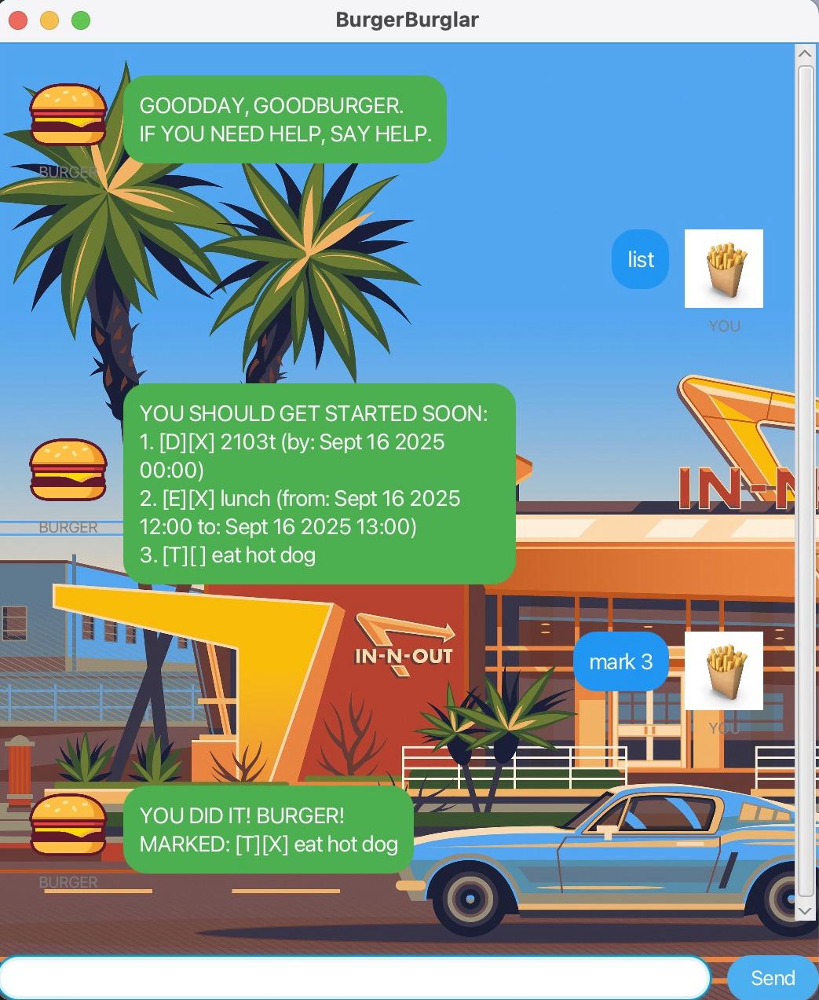
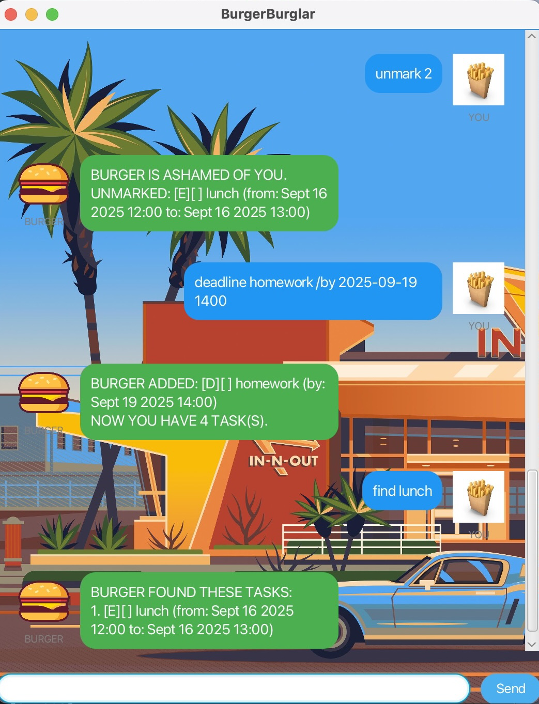

# 🍔 BurgerBurglar User Guide

Welcome to **BurgerBurglar**, your friendly task-managing chatbot. This guide will walk you through the setup and key features so you can get started right away.

---

## Product Screenshot

The screenshot below shows the full GUI window of BurgerBurglar.

---

## Getting Started

1. Download and run the BurgerBurglar application.
2. A window will appear with a text box for commands and a display area for tasks.
3. Type your commands into the input box and press **Enter**.

That’s it — BurgerBurglar will handle the rest.

---

## ✨ Features

BurgerBurglar supports the following commands:

| Command | Format | Description |
|---------|--------|-------------|
| `todo` | `todo <description>` | Add a Todo task |
| `deadline` | `deadline <description> /by <yyyy-MM-dd HHmm>` | Add a Deadline task with a due date |
| `event` | `event <description> /from <yyyy-MM-dd HHmm> /to <yyyy-MM-dd HHmm>` | Add an Event with a start and end time |
| `list` | `list` | Show all tasks |
| `mark` | `mark <index>` | Mark a task as done |
| `unmark` | `unmark <index>` | Unmark a completed task |
| `delete` | `delete <index>` | Delete a task |
| `find` | `find <keyword>` | Search for tasks by keyword |
| `help` | `help` | Show the help menu |
| `bye` | `bye` | Exit the program |
| `burger` | `burger` | 🍔 Bonus command |

---

## 📷 Example Usage

Here are some sample screenshots showing BurgerBurglar in action:

---

## Tips

- Dates and times must follow the format: `yyyy-MM-dd HHmm`.  
  Example: `deadline Submit report /by 2025-09-20 2359`
- Commands are mostly case-insensitive. Use lowercase.
